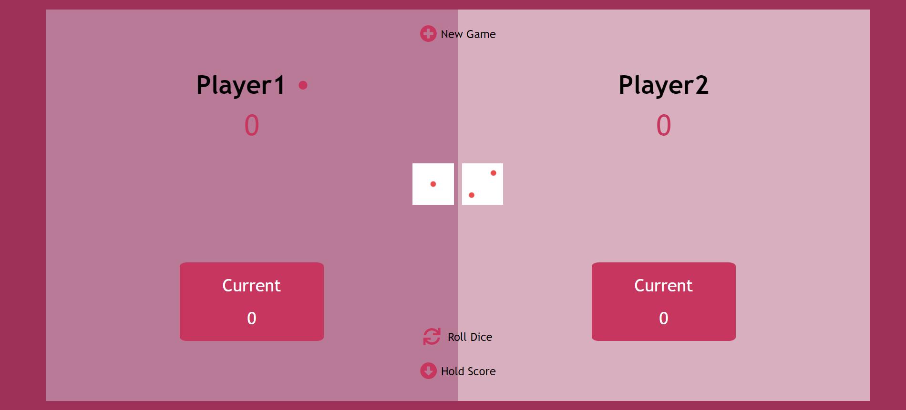
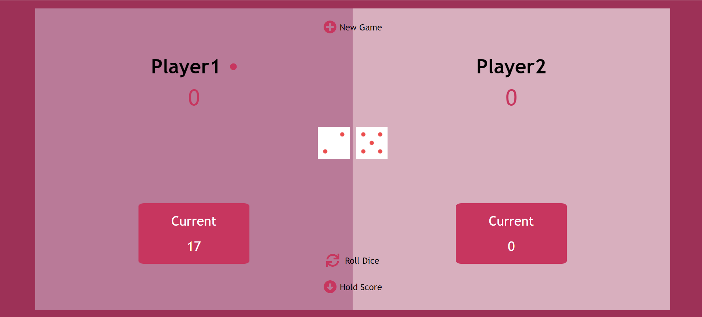
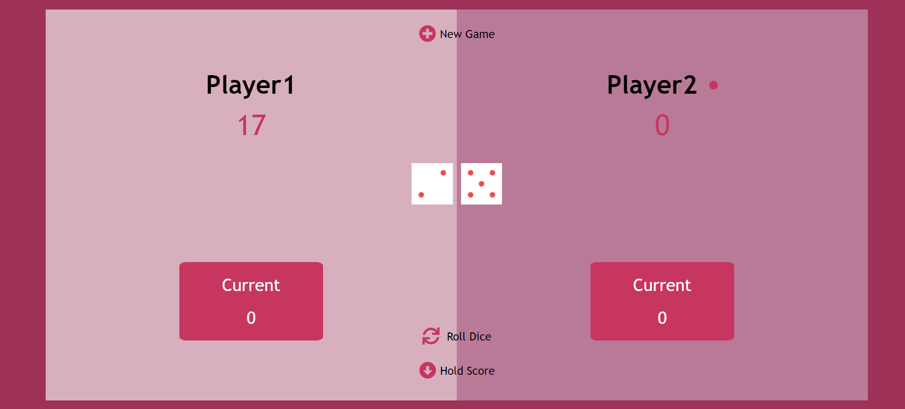
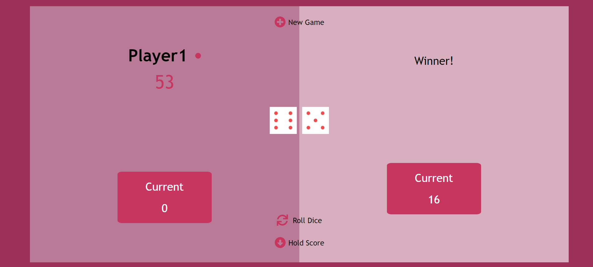
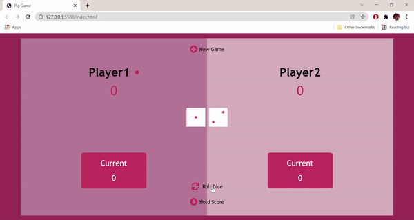

**Pig-Game** : :jack_o_lantern:
A web app that is built with **HTML5,CSS3 & Vanilla JAVASCRIPT**  

> Note : Make sure you have the internet connection to render icons.

## Table of contents
- [General Info](#General-Info-)
- [Screenshots](#screenshots-)
- [Preview](#preview-)
- [Installation](#Installation-)
- [Technologies](#Technologies-Used-)
- [Game-Rules](#Game-Rules)

## 1. General Info 📝
The purpose of this project is to understand and implement the javascript concepts that i've learned to make the user interface look appealing besides having fun along the journey :smiley:.

## 2. Screenshots 📸






## 3. Preview 🎥



## 4. Installation 📀

#### Clone the repo

```sh
$ git clone https://github.com/preetamvarun/Pig-Game.git
$ cd Pig-Game/
```

#### Run the app
```sh
open index.html with a browser you prefer
```
## 5.Technologies Used ✳️

[](https://devdocs.io/javascript/)   
[](https://devdocs.io/html/)   
[](https://devdocs.io/css/) 

## 6. Game Rules
The game has 2 players, playing in rounds <br>
In each turn, a player rolls a dice as many times as he wants. Each result get added to his ROUND score.<br>
BUT, if the player rolls a 1 (in either of the dice), all his ROUND score gets lost. After that, It's the next player's turn.<br>
The player can choose to 'Hold', which means that his ROUND score gets added to his GLOBAL score. After that, It's the next player's turn<br>
The first player to reach 100 points or more on GLOBAL score wins the game.

## 7. Features
User friendly 🔥
clean UI ⭐
Responsive 😉

